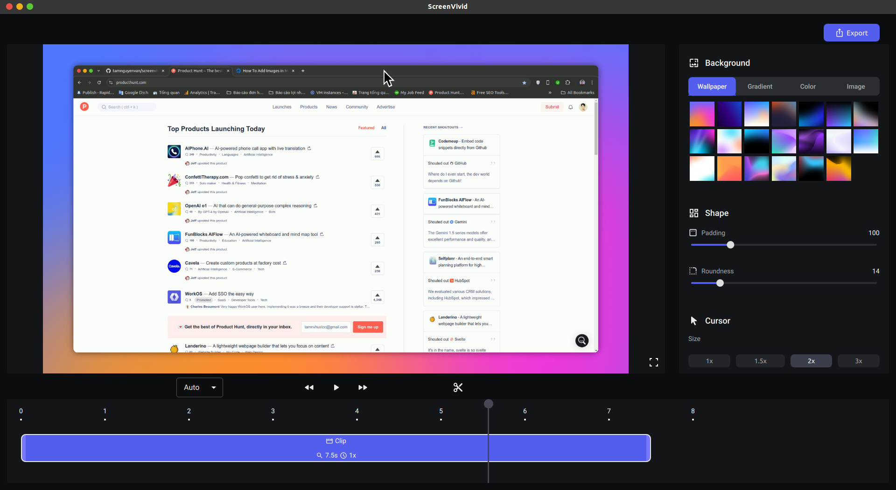

<br>
<br>

ScreenVivid is a powerful and user-friendly screen recording application that allows you to capture your screen and enhance your recordings with intuitive editing features.

## Table of Contents

- [Features](#features)
- [Installation Guide](#installation-guide)
  - [System Requirements](#system-requirements)
  - [Linux Installation](#linux-installation)
  - [Windows Installation](#windows-installation)
  - [MacOS Installation](#macos-installation)
  - [Troubleshooting Installation](#troubleshooting-installation)
- [Advantages](#advantages)
- [Current Limitations](#current-limitations)
- [Roadmap](#roadmap)
- [Support](#support)
- [License](#license)

## Features

- Screen recording with high quality output
- Video enhancement tools (backgrounds, padding, etc.)
- User-friendly interface
- Cross-platform support (Ubuntu/Debian and Windows)



## Installation Guide

### System Requirements

- **Ubuntu/Debian**:
  - The app is based on PySide6, which requires glibc-2.28+. It supports Ubuntu 20.04 or later, Debian 10 or later, and other distributions with glibc 2.28+ such as Fedora 29+, CentOS 8+, and OpenSUSE Leap 15.1+.
  - 4GB RAM (8GB recommended)
  - **ScreenVivid uses [python-mss](https://github.com/BoboTiG/python-mss) to capture the screen, making it compatible only with operating systems that use X11.**
- **Windows**:
  - Windows 10 or later
  - 4GB RAM (8GB recommended)

### Linux Installation

1. Install system dependecies if needed:
   ```bash
   # Debian/Ubuntu-based (e.g., Ubuntu, Linux Mint)
   sudo apt-get install curl git python3-tk python3-dev python3-venv libxcb-cursor0 -y

   # Fedora/CentOS 8 and later (Red Hat-based)
   sudo dnf install curl git python3-tkinter python3-devel python3-venv xcb-util-cursor -y
   ```

2. Install the app:

   ```bash
   curl -fsSL https://github.com/tamnguyenvan/screenvivid/raw/main/scripts/install-linux.sh | bash
   ```

After the installation finished, you can search `ScreenVivid` in Appplication menu and use it. You can also run `screenvivid` command in terminal to start the app.

Uninstall the app:

```bash
curl -fsSL https://raw.githubusercontent.com/tamnguyenvan/screenvivid/main/scripts/uninstall-linux.sh | bash
```

### Windows Installation

1. Grab the latest .exe installer from our Releases page.
2. Run the file to install ScreenVivid.
3. Launch the program from your Start Menu or that new Desktop shortcut.


### MacOS Installation
1. Install system dependecies if needed:
```bash
# Install Homebrew if not installed
/bin/bash -c "$(curl -fsSL https://raw.githubusercontent.com/Homebrew/install/HEAD/install.sh)"

# Install dependencies
brew install curl git python3 tcl-tk
```
2. Install the app:
```bash
curl -fsSL https://github.com/tamnguyenvan/screenvivid/raw/main/scripts/install-macos.sh | bash
```

Uninstall the app:
```bash
/bin/bash -c "$(curl -fsSL https://raw.githubusercontent.com/tamnguyenvan/screenvivid/main/scripts/uninstall-macos.sh)"
```

## FAQs


## Advantages

- Easy to use
- Cross-platform
- Intuitive and simple interface
- Completely free
- Lightweight and fast

## Current Limitations

- Advanced features like zoom, audio capture, and webcam integration are not yet available.

## Roadmap

We're constantly working to improve ScreenVivid. Here are some features we're planning to add in the future:
- [ ] Advanced editing features (zoom, audio, webcam integration)

## Support

If you encounter any issues or have questions, please:

1. Check our [FAQ](#faqs)
2. Visit our [community forums](https://discord.gg/NKtmBnR6nE)
3. Contact us at tamnnv.work@gmail.com

## License

ScreenVivid is released under the MIT License. See the LICENSE file for more details.

---

Thank you for choosing ScreenVivid for your screen recording needs! If you find our software helpful, please consider donating to support its development and help us add more amazing features! 💖