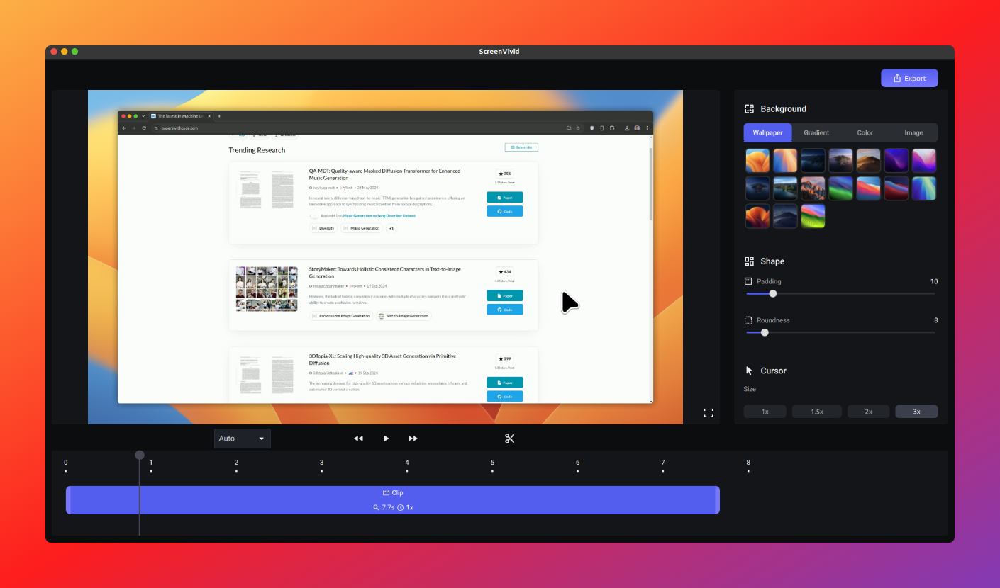

<br>
<br>

## Overview

[ScreenVivid](https://screenvivid.com) is a powerful and user-friendly screen recording application designed to help you capture your screen and enhance your recordings with intuitive editing features. Whether you're creating tutorials, recording meetings, or capturing gameplay, ScreenVivid is the perfect tool for you.

🚨 **Important Note**: ScreenVivid is intended for non-commercial use only. We encourage you to review the license for more information to ensure compliance. Your understanding and adherence to this guideline are greatly appreciated!

## Table of Contents

- [Features](#features)
- [Installation Guide](#installation-guide)
  - [System Requirements](#system-requirements)
  - [Linux Installation](#linux-installation)
  - [Windows Installation](#windows-installation)
  - [MacOS Installation](#macos-installation)
  - [Building from Source](#building-from-source)
- [Advantages](#advantages)
- [Current Limitations](#current-limitations)
- [FAQs](#faqs)
- [Roadmap](#roadmap)
- [License](#license)
- [References](#references)
- [Support](#support)

## Features

- **Cross-platform support**: ScreenVivid is available on MacOS, Windows, and Linux, ensuring you can record your screen regardless of your operating system.
- **High-quality screen recording**: Capture your screen with high-quality output, perfect for creating professional-looking videos.
- **Free and open-source**: ScreenVivid is completely free to use and open-source, allowing the community to contribute and improve the application.
- **Video enhancement tools**: Enhance your recordings with backgrounds, padding, and other intuitive editing features.
- **Intuitive and simple interface**: ScreenVivid's user-friendly interface makes it easy to start recording and editing your screen captures.



## Installation Guide

### System Requirements

- **MacOS**:
  - **Minimum Requirements:** MacOS 11.0+, 4GB RAM (8GB recommended)
- **Windows**:
  - **Minimum Requirements:** Windows 10 or later, 4GB RAM (8GB recommended)
- **Linux**:
  - **Minimum Requirements**: Python 3.9+, glibc 2.28+, X11 (recommended: Ubuntu 21.04+ or Debian 11+), 4GB RAM (8GB recommended)
  - **Compatibility Note**: ScreenVivid only supports Python 3.9+ and is optimized for systems running glibc 2.28+. Additionally, it is designed specifically for X11 environments. While it may work on other systems, such as Wayland, its functionality is not guaranteed.
### Linux Installation
Download the latest .deb package from our [Releases page](https://github.com/tamnguyenvan/screenvivid/releases).

```bash
# Ubuntu/Debian (apt-get)
sudo dpkg -i screenvivid_x.x.x_amd64.deb

# Install missing packages if needed
sudo apt install -f

# For other distributions, please refer to the section on Building from Source
```

### Windows Installation

1. Download the latest .exe installer from our [Releases page](https://github.com/tamnguyenvan/screenvivid/releases).
2. If Windows displays a warning during download, click "Keep anyway" to proceed.
3. Run the installer. If you see a SmartScreen warning, click "More info" and then "Run anyway" to continue.
4. Follow the installation prompts to complete the setup.
5. Launch the program from your Start Menu or the newly created Desktop shortcut.

🚨 **Important Note**: Due to current budget constraints, our application is not code-signed. This may trigger Windows security warnings, but rest assured that our software is safe to use. We're working on obtaining a code signing certificate in the future to eliminate these warnings.


### MacOS Installation
Download the latest .dmg package from our [Releases page](https://github.com/tamnguyenvan/screenvivid/releases).

1. Open the DMG file and drag the ScreenVivid icon to the `Applications` folder.
2. Run the app from your `Applications` folder.

🚨 **Important Note:** As the app is not notarized, Gatekeeper may display a warning. To proceed, go to System `Settings > Privacy & Security > Security`, select "Open Anyway", and confirm with your login password. For more information, please refer to [this guide](https://support.apple.com/en-vn/guide/mac-help/mchleab3a043/mac).

### Building from Source

For systems without installation file support, ScreenVivid can be run using Python by following these steps:

1. Install dependencies
  - **Minimum Requirements:** Python>=3.9,<3.12. Using miniconda is highly recommended.

```bash
# Ubuntu/Linux Mint/Debian:
sudo apt install python3-tk python3-dev libxcb-cursor0 ffmpeg

# Fedora:
sudo dnf groupinstall -y "Development Tools" && sudo dnf install -y python3-devel python3-tkinter xcb-util-cursor ffmpeg

# macOS:
brew install ffmpeg

# Windows:
## 1. Download the FFmpeg static binary for Windows:
https://github.com/BtbN/FFmpeg-Builds/releases/download/latest/ffmpeg-n7.1-latest-win64-gpl-7.1.zip

## 2. Unzip it and place ffmpeg.exe in the root of the project folder.

```

2. Install requirements
```bash
# Linux
pip install -r requirements.txt

# macOS
pip install "pyobjc-framework-Quartz>=10.3.1,<10.4" && pip install -r requirements.txt

# Windows
pip install "pywin32>=306,<308" && pip install -r requirements.txt
```

3. Compile resources
```bash
cd screenvivid
python compile_resources.py
```

4. Run
```bash
python -m screenvivid.main
```

## Advantages

- **Easy to use**: ScreenVivid's intuitive interface makes it easy to start recording and editing your screen captures.
- **Cross-platform**: Available on MacOS, Windows, and Ubuntu/Debian, ensuring you can record your screen regardless of your operating system.
- **Intuitive and simple interface**: ScreenVivid's user-friendly interface makes it easy to start recording and editing your screen captures.
- **Completely free**: ScreenVivid is completely free to use and open-source, allowing the community to contribute and improve the application.
- **Lightweight and fast**: ScreenVivid is designed to be lightweight and fast, ensuring a smooth recording experience.

## Current Limitations

- **Advanced features**: Advanced features like zoom, audio capture, and webcam integration are not yet available.

## FAQs

1. **Q: Is ScreenVivid free?**

   A: Yes, ScreenVivid is completely free for personal use. However, commercial use is not permitted under our license.

2. **Q: I see a security warning when downloading and running the installer. Is it safe?**

   A: Due to budget constraints, we haven't yet been able to obtain a code signing certificate for our installer. This is why you may see security warnings. Rest assured, our software is safe to use. We're working on getting a certificate as soon as possible to eliminate these warnings.

3. **Q: Can I contribute to the project?**

   A: Absolutely! We welcome contributions from the community. Please check our GitHub repository for information on how to contribute, or reach out to us directly if you have specific ideas or skills you'd like to offer.

4. **Q: I encountered missing packages when installing the .deb file. What should I do?**

   A: You can install the missing packages by running the command `sudo apt install -f`.


## Roadmap

We're constantly working to improve ScreenVivid. Here are some features we're planning to add in the future:
- [ ] **Advanced editing features**: Zoom, audio capture, and webcam integration.
- [ ] **Export to GIF**: Ability to export recordings as GIF files.
- [ ] **Output file compression**: Option to compress exported files for smaller file sizes.

## License

ScreenVivid is released under the Creative Commons Attribution-NonCommercial-ShareAlike 4.0 International License. See the LICENSE file for more details.

## References

- [PySide6](https://pypi.org/project/PySide6/)
- [python-mss](https://github.com/BoboTiG/python-mss)
- [pyautogui](https://github.com/asweigart/pyautogui)


## Support

If you encounter any issues or have questions, please:

1. Check our [FAQ](#faqs)
2. Visit our [community forums](https://discord.gg/NKtmBnR6nE)
3. Contact us at tamnnv.work@gmail.com

---

Thank you for choosing ScreenVivid for your screen recording needs! If you find our software helpful, please consider donating to support its development and help us add more amazing features! 💖

